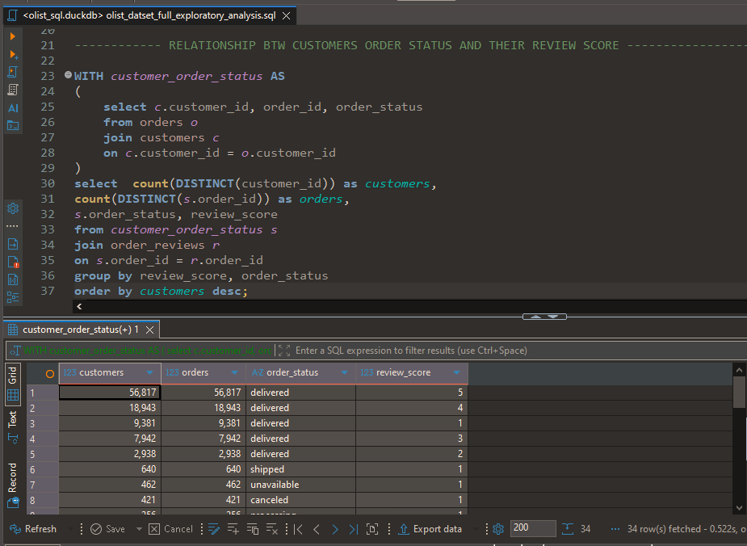
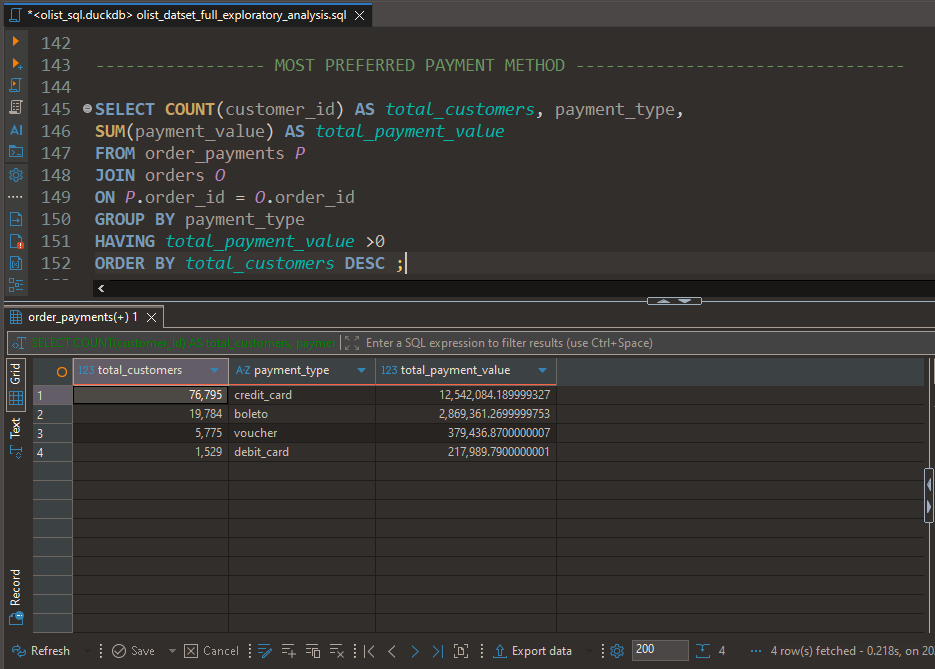

# Olist E-Commerce SQL Analysis

### End-to-End SQL Analysis of a Brazilian E-Commerce Marketplace

[](https://www.sql.org/)
[](https://duckdb.org/)
[](https://dbeaver.io/)
[](#)

> An end-to-end SQL analysis of the Olist Brazilian e-commerce dataset, covering data validation, exploratory analysis, customer and order behavior, delivery performance, product demand, payment activity, seller performance, and business recommendations.

---

## 📌 Project Overview

This project analyzes the **Olist Brazilian e-commerce marketplace** using SQL to examine how customers, orders, products, payments, reviews, delivery operations, and sellers interact across the marketplace.

The analysis follows a structured workflow:

**Validate → Explore → Interpret → Recommend**

### Core Objectives

* Validate data quality and relational integrity
* Explore customer, order, product, payment, review, and seller behavior
* Identify operational and commercial patterns
* Translate analytical findings into actionable business recommendations

---

## 🔎 What Was Analyzed

| Area          | Focus                                              |
| ------------- | -------------------------------------------------- |
| **Customers** | Geographic distribution and customer concentration |
| **Orders**    | Order status and fulfillment activity              |
| **Reviews**   | Review scores and response intervals               |
| **Delivery**  | Delivery performance and delays                    |
| **Products**  | Category demand and monetary contribution          |
| **Payments**  | Payment methods, values, and payment differences   |
| **Sellers**   | Order volume and geographic concentration          |

---

## 📊 Key Findings

* **96,478 orders** were recorded as delivered, making delivery the dominant order status.
* Customer activity is strongly concentrated geographically, with **São Paulo** representing the largest customer market.
* **Credit card** is the dominant payment method by customer activity and payment value.
* `cama_mesa_banho` recorded the highest order volume among the product categories analyzed.
* High order volume did not always correspond to the highest monetary contribution across categories.
* Seller activity was concentrated among a relatively small group of high-order-volume sellers.
* Significant delivery delays were identified within delivered orders, highlighting potential operational and customer-experience concerns.

➡️ **[View detailed Business Findings, Insights & Recommendations](documentation/business_findings_insights_and_recommendations.md)**

---

## 🧪 Analytical Workflow

### 01 — Data Validation & Quality Assessment

The dataset was examined for:

* Table structures and record counts
* Data types and formatting consistency
* Missing and blank values
* Duplicate records
* Referential integrity
* Logical data-quality issues

➡️ **[View Data Cleaning & Validation](documentation/data_cleaning_and_validation.md)**

### 02 — Exploratory Data Analysis

SQL was used to investigate:

* Customer and geographic distribution
* Order-status patterns
* Customer review behavior
* Delivery performance and delays
* Product-category demand
* Payment behavior
* Seller performance and concentration

➡️ **[View Exploratory Data Analysis](documentation/exploration_data_analysis.md)**

### 03 — Business Findings & Recommendations

The analytical results were translated into business-focused findings and recommendations across:

* Customer concentration
* Delivery operations
* Product demand
* Payment behavior
* Additional charges
* Seller performance

➡️ **[View Business Findings & Recommendations](documentation/business_findings_insights_and_recommendations.md)**

---

## 📸 Exploration Process

Selected screenshots from the SQL exploration workflow:





---

## 🛠️ Tools & Technologies

| Tool                          | Purpose                                   |
| ----------------------------- | ----------------------------------------- |
| **SQL**                       | Data validation, exploration and analysis |
| **DuckDB**                    | Analytical database engine                |
| **DBeaver**                   | SQL development environment               |
| **Microsoft Word & Markdown** | Analytical documentation                  |

---

## 🗃️ Dataset

The project uses the **Olist Brazilian E-Commerce public dataset**, obtained through Kaggle's Olist organization.

🔗 **[Dataset Source](https://www.kaggle.com/organizations/olistbr)**

The dataset contains relational tables covering customers, orders, products, sellers, payments, reviews, geolocation, and product-category translations.

### Core Tables

| Table                          |   Records |
| ------------------------------ | --------: |
| `customers`                    |    99,441 |
| `geolocation`                  | 1,000,163 |
| `order_items`                  |   112,650 |
| `order_payments`               |   103,886 |
| `order_reviews`                |    99,224 |
| `orders`                       |    99,441 |
| `products`                     |    32,951 |
| `sellers`                      |     3,095 |
| `product_category_translation` |        71 |

---

## 📁 Repository Structure

```text
Olist-Ecommerce-SQL-Analysis/
│
├── data/
│
├── sql/
│   ├── 01_data_validation/
│   ├── 02_exploration_analysis/
│   └── ...
│
├── documentation/
│   ├── data_cleaning_and_validation.md
│   ├── exploration_data_analysis.md
│   └── business_findings_insights_and_recommendations.md
│
├── results/
│   └── screenshots/
│
├── assets/
│
└── README.md
```

---

## 🖥️ SQL Environment

The project was developed in **DBeaver using DuckDB**, with SQL serving as the primary language throughout the validation and analytical workflow.


---

## 🎯 Project Outcome

This project demonstrates how SQL can be used beyond query writing to move from **data quality assessment to business analysis**.

The final analysis connects relational e-commerce data to questions around:

* Customer behavior
* Geographic concentration
* Order fulfillment
* Customer experience
* Product demand
* Payment behavior
* Seller performance
* Pricing and additional charges

The result is a documented SQL analysis that translates raw marketplace data into **business-relevant findings and recommendations**.

---

# 👨‍💻 Author

### Opeyemi (Ismail) Peter

**Data Analyst | Business Intelligence | SQL | Python | Excel | Tableau**

I enjoy transforming raw and complex datasets into meaningful insights, building analytical solutions, and communicating findings clearly to support data-driven decision-making.

### Connect With Me

* **GitHub:** [Cephasia](https://github.com/Cephasia)
* **LinkedIn:** [Opeyemi Peter](https://www.linkedin.com/in/opeyemi-peter-394b333a1)
* **Email:** [Send me an email](mailto:ismailopeyemi3310@gmail.com?subject=Hello%20Opeyemi%20Peter!)

---

## ⭐ Thank You

Thank you for taking the time to explore this project.

If you find the analysis useful, feel free to explore the SQL queries and supporting documentation throughout the repository.
